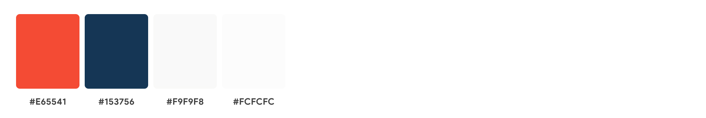

# **Discover Co-working Spaces in Singapore**

 

## 1. Project Summary

### **Background**
Co-working workplaces are becoming increasingly popular as the demand for flexible working arrangements increases, especially since many workers become distracted by the constant work-from-home routine due to the COVID pandemic. Workers who were driven to work from home since the pandemic are experiencing burn-out and becoming less productive due to the blurring of work life boundaries. While cafes can also be a great alternative for remote working and hotdesking, there is no guarantee of good wi-fi, table space or or other necessities required to fufill basic working needs.

### **Organisation Goals**
A website with an interactive map that allows target users to search for their ideal Co-working spaces or offices in Singapore that meets their working or business needs.

### **User Goals**
Remote workers can easily search for available co-working spaces in Singapore. As work-life balance is also an important aspect of a healthy working environment, the website also allows users to look for nearby gyms and supermarkets to fufill their fitness or lifestyle needs after working hours. 

### **Project Justification**
Remote working and hotdesking are proving to be the new normal in the future of work, and co-working spaces are the next best solution away from a traditional office environment. The website would be a useful tool to help target users to search and discover working spaces all around Singapore.

 

## 2. UI/UX

### **User Stories**
| User Story                                                                                                                             	| Acceptance Criteria                                                                                       	|
|----------------------------------------------------------------------------------------------------------------------------------------	|-----------------------------------------------------------------------------------------------------------	|
| As a remote worker, i would like a conducive and productive work environment that caters to my daily working needs.                    	| A working space has power outlet, sufficient desk space, good wifi and stationery etc.                      	|
| As an office employee working from home, i would like a work environment that could maintain my boundaries of work and personal life.  	| A work environment that offers structure and routine to my work days, and is accessible 24/7 on weekdays. 	|
| As a freelancer / entrepreneur, i would like a comfortable working space that could boost my creativity and help me inspire new ideas. 	| An innovative, open space unlike traditional offices that allows for collaboration.                       	|
| As an entreprenuer, i would like a work environment that allows me to network and connect with business professionals.                 	| A work space that allows for opportunity to meet new people that would help grow my business.             	|

### **5 Planes of UI/UX**
#### 1. Strategy
1. **Target Users**: Remote workers, freelancers, entrepreneurs who are looking for an alternative to working at home or would like a conducive and productive working environment.
2. **Users Needs**: User needs to easily and conviently search for workspaces in Singapore that meets their day to day working or business needs.
3. **Site Objective**: To suggest or help target users search for their ideal workspaces by giving an overview of the different locations of co-working spaces in singapore via an interactive map, or help users to search for available co-working spaces around an area.

### 2. Scope
**Functional Requirements:**
- Allows users to perform basic search using a search bar. Users are able to search by location and keyword.
- An interactive map that displays the location of all the search results and users are able to toggle between different map layers showing locations of nearby amenities.
- An informative display of search results that provides the address, opening hours and link to website for more information.
- Users can choose to hide the search results to allow the map a larger area for viewing and interaction.

**Non-Functional Requirements:**
- Mobile responsiveness: to cater to users on the go who are usi
ng the app on their mobile devices.
- Usability: Easy to perform the search and view search results.

### 3. Structure
**Interaction Design:**
1. Discoverability & Accessibility:
    - Search bar and search button is prominently displayed. Size of the search button is large to allow a larger clickable area for ease of clicking.
    - Search bar is also accessible on both the home page and on the map.
    - Icons on map buttons are labelled for clarity.
2. Consistency:
    - Consistent font styles, background and colours are used throughout to eliminate confusion of the user.
    - Graphic elements are placed at commonly used locations on the web page that are familiar to the user (i.e. logo on the top left and search bar on top)
3. Learnability:
    - User interface is intuitive and easy to use
4. Error Prevention & Recovery
    - Dsiplay an error message to the user when user performs an invalid search. A simple instruction is given to help the user perform a valid search.

**Information Architecture:**
1. A linear web structure to optimise user-friendliness.

### 4. Skeleton
**Interface Design:**

Below are some of the factors that have been considered when designing the user interface:
1. Resonsiveness
    - UI elements and text are able to fit on different screen sizes while still maintaing a visually pleasant look.
    - search bar is hidden and made into a collapsible bar on smaller screen devices.
2. Contrast
    - Contrast is applied to important text (i.e. title of search result), icons and search button as best as possible to draw users attention
3. Familiarity
    - UI elements (i.e. search box, search button, close button, links etc.) are intuitive and performs the expected behaviour that users have been accustomed to.
4. Font and colour weight
    - To establish visual hierarchy, all headings have bolder font weight than body text. Important elements such as the search button have a stronger colour. Supporting information (i.e. opening hours, address) have a lighter font weight.
5. Typography
    - To ensure a comfortable reading experience, only one typeface is used (default typeface of bootstrap).

**Skeleton:**

### 5. Visual Design
**Colour Palette**

A simple colour palette with vibrant orange and dark blue to create a professional look and balanced out with a neutral off-white colour.

 

## 3. Features

### **Map**
The website uses leaflet map to mark the locations of the search results and display a popup of photos and address details when user clicks on the location on the map. User can also toggle between map layers to show and hide the amenities nearby the targetted location.

 

## 4. Technologies Used / Credits

- Built using HTML, CSS, Bootstrap and Javascript
- Map is created using Leaflet (https://leafletjs.com/SlavaUkraini/reference.html)
- Data sources:
    - Foursquare places API (https://developer.foursquare.com/docs/places-api-overview)
    - Geojson of gyms and supermarket locations in Singapore from https://data.gov.sg/
- Home page background from Unsplash (https://unsplash.com/photos/J67BWDuNq0U)
- All icons from font awesome (https://fontawesome.com/)

 

## 5. Testing

### **Perform basic search on home page**
1. Input a location (e.g. Raffles) and/or keyword (e.g. Wework) into the search field and click on search.
2. Website should take you to the next page where the search results will appear along with a map displaying the locations of the search results.
3. In cases where user keys in a search word containing special characters (i.e. ~!@#$%^&*_+(){}|:"<>?), an error message will appear
4. In cases where user performs an empty search (no search word in the input fields), website would show 50 suggestions of co-working spaces in singapore.

### **Perform basic search on map page**
1. To peform a new search, input a new location and/or keyword into the search field and click on search
2. Search results would refresh and display results of the new search
3. In cases where user keys in a search word containing special characters (i.e. ~!@#$%^&*_+(){}|:"<>?), an error message will appear on the search results display.

### **Toggle map layers**
1. Click on the buttons on the top of the map to hide / show the locations of food, gyms and supermarket.
2. Locations of nearby food will only be displayed for the co-working spaces searched by the user. For gyms and supermarkets, the map will display their locations all over Singapore.

### **Hide and show search results**
1. click on the "close" button at the top left of the search results display to hide the search results.
2. click on the icon at the bottom left of the map to show the search results.

### **Check hyperlink**
1. Perform an empty search on the website to show 50 suggestions of Co-working spaces in singapore.
2. scroll through the search results and click on "visit website" of any search result.
3. Website will be opened in a new tab

### **Return to homepage**
1. Go back to the home page by clicking on the logo at the top left of the page.
2. Webiste should return to the main page

